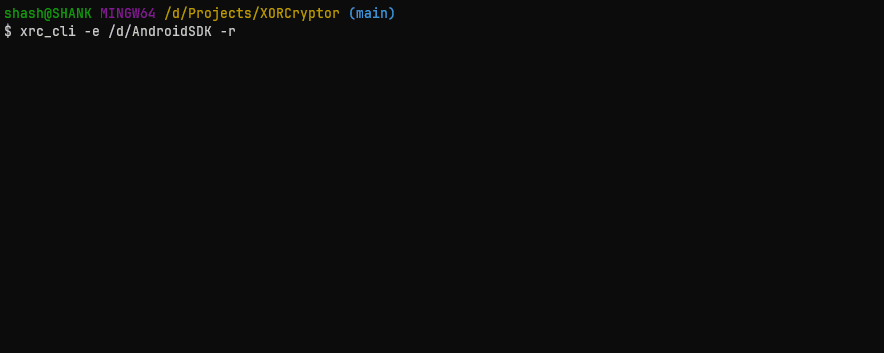

# `XORCryptor`

[](https://crates.io/crates/xrc_cli)

Encrypts or decrypts the file(s) using algorithm based on XOR bitwise operation.

[About algorithm](https://github.com/shank03/XORCryptorLib/blob/main/About.md) -  [Implementation lib](https://crates.io/crates/xor_cryptor)



Older C++ version: [CLI](https://github.com/shank03/XORCryptor/tree/cli)

### `CLI`

This cli encrypts or decrypts the file(s) in synchronized multi-buffered multithreading way.

So the only bottleneck is your disk read/write speed.

### `Installing CLI`

```shell
$ cargo install xrc_cli
```

## `Usage`

```
Usage: xrc_cli [OPTIONS] <files>...

Arguments:
  <files>...  Files and folders to process

Options:
  -e, --encrypt  Encrypt
  -d, --decrypt  Decrypt
  -r             Recursively iterate folders if present
  -j <jobs>      No. of jobs
  -h, --help     Print help information
  -V, --version  Print version information
```

<details>
<summary>Click to expand for examples</summary>

It will ask for key everytime you encrypt or decrypt some file

### Encrypt

```shell
$ xrc_cli -e  file.ext
```

```
Before command:         After command:

random_folder           random_folder
    |- some_fld             |- some_fld
    |   |- t.txt            |   |- t.txt
    |   |- p.txt            |   |- p.txt
    |   |- in_fld           |   |- in_fld
    |       |- v.mp4        |       |- v.mp4
    |- file.ext             |- file.ext.xrc
```

### With Folder

```shell
$ xrc_cli -e  file.ext some_fld
```

```
Before command:         After command:

random_folder           random_folder
    |- some_fld             |- some_fld
    |   |- t.txt            |   |- t.txt.xrc
    |   |- p.txt            |   |- p.txt.xrc
    |   |- in_fld           |   |- in_fld
    |       |- v.mp4        |       |- v.mp4
    |- file.ext             |- file.ext.xrc
```

### Preserve source

```shell
$ xrc_cli -p -e file.ext some_fld
```

```
Before command:         After command:

random_folder           random_folder
    |- some_fld             |- some_fld
        |- t.txt            |   |- t.txt
        |- p.txt            |   |- t.txt.xrc
        |- in_fld           |   |- p.txt
        |   |- v.mp4        |   |- p.txt.xrc
        |- file.ext         |   |- in_fld
                            |       |- v.mp4
                            |- file.ext
                            |- file.ext.xrc
```

### Iterate Recursively

```shell
$ xrc_cli -r -e  file.ext some_fld
```

```
Before command:         After command:

random_folder           random_folder
    |- some_fld             |- some_fld
    |   |- t.txt            |   |- t.txt.xrc
    |   |- p.txt            |   |- p.txt.xrc
    |   |- in_fld           |   |- in_fld
    |       |- v.mp4        |       |- v.mp4.xrc
    |- file.ext             |- file.ext.xrc
```

</details>

### NOTE !

> DO NOT FORGET THE KEY YOU GAVE FOR ENCRYPTION
